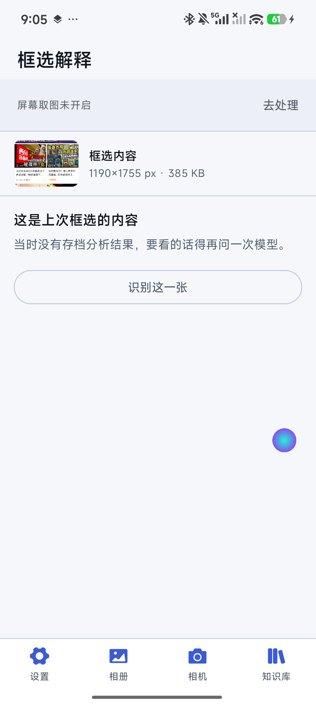
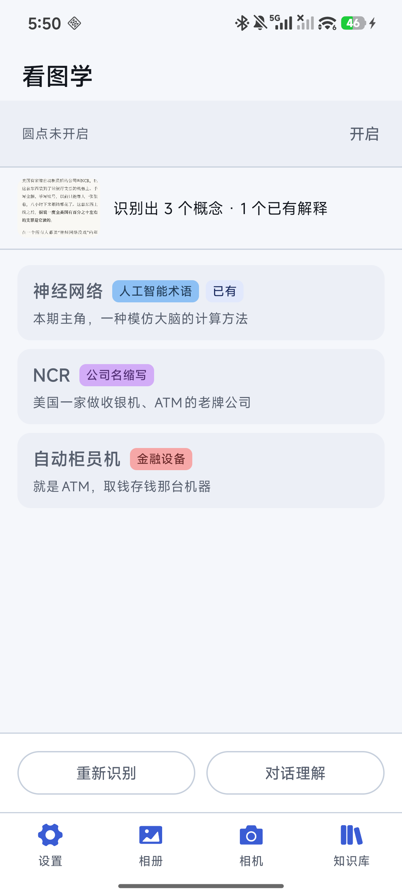
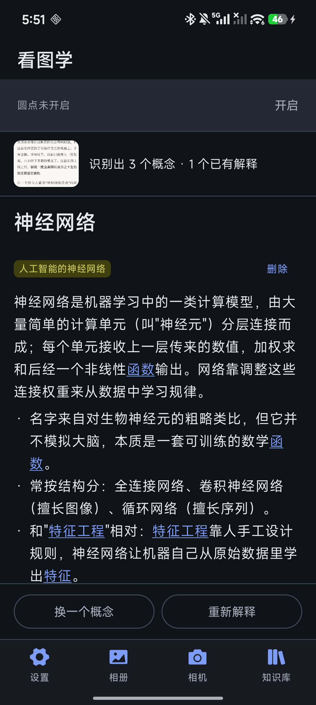
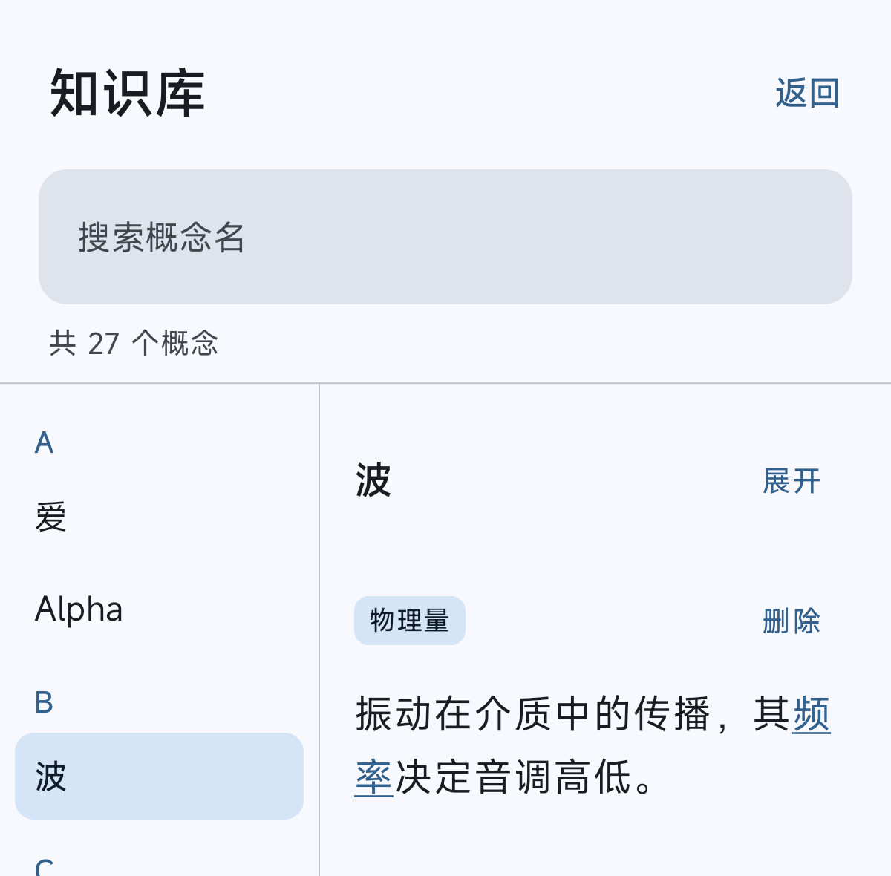

# 看图学 · ExplainDot

> 读书时遇到看不懂的词，框一下，就地看懂。

一个 Android 屏幕阅读辅助工具。它常驻一颗小圆点，**长按**它、随手划出要解释的范围，
截图就送去 DeepSeek；回来的是这一页里几个可能看不懂的概念，点其中任意一个，
得到的是一段**脱离原文也能站得住的解释**——而这段解释里出现的其他术语，
本身就是可点的链接，可以一路读下去。

看过的解释会攒进手机上的一个小知识库。同一个词第二次遇到直接出结果，
不再请求模型。

<p align="center">
  
  
  
  
</p>

<p align="center"><sub>左起：圆点常驻在别的应用之上 · 首页挑出的概念 · 解释正文 · 知识库</sub></p>

---

## 它是怎么用的

整个交互只有四步，都在屏幕边缘完成，不用切来切去：

|  | 动作 | 说明 |
|---|---|---|
| 1 | **长按圆点** | 圆点会先隐身并震一下——那一震是唯一的反馈，因为屏幕上正好什么都看不见 |
| 2 | **接着划出范围** | 手指不用松开，长按达成后继续滑就是框选；在这期间屏幕上会被覆一层遮罩 |
| 3 | **看概念列表** | 松手即截图，结果直接落在首页：这页里那几个词值得解释。底部两个按钮是「重新识别」和「对话理解」 |
| 4 | **点进去读** | 解释按「义项」分节。正文里其他概念就是可点的链接，可以一路读下去 |

途中随时能按系统返回键往回走，回到上一层的概念——跳转历史是一整条栈，
可以 A→B→C 再按三次返回依次退回。钻深了还有「回到概念列表」一次弹到底。

圆点可以拖到屏幕任意位置，位置会记住。它在横竖屏切换后也会被拉回屏幕内。

## 几个有意的设计选择

这些是写的时候反复权衡过的地方，也是这个项目里真正花时间的地方。

**截图走无障碍通道，不走 MediaProjection。**
`AccessibilityService#takeScreenshot()` 和电源键截屏同源，不建立投屏会话——
所以小米那种「屏幕共享防护」拦不到它，微信文章里打码不了的内容走这条路能拿到原图。
代价是没有备用通路：拿不到图就明确报错，而不是悄悄回落到一张被打码的图上。
**在最需要它的场景里给出一份错的东西，比明确失败更糟。**

**圆点只在自己那 48dp 的窗口里吃触摸。**
全屏的框选层只在长按达成之后才挂载，正常阅读时它根本不存在，
所以不会挡住你在别的应用里点击。框选层还带一个 10 秒闲置超时——
万一用户长按完走开了，不至于整台手机都点不动。

**解释存 SQLite，不存内存缓存。**
换一张图、换一个模型都不该让一条正确的解释失效。于是
「有没有缓存」的判据从「内存里有没有」变成了「库里有没有」，
统一在一处；命中就是瞬时的，一次请求都不发。

**流程状态挂在进程级的单例上，不挂 Activity。**
跳去设置页看权限、在别的应用里读书、转屏——这些都会销毁 Activity，
而链路上有两件很贵的资产：用户等的那个答案，和已经花掉的那次请求。

**同步搬的是整个数据库文件，不是 JSON 导出。**
换来的是「两边逐字节一致」；代价是远端那份不再可读、不可 diff。
这是明确选的，所以校验必须在动本地之前做完——换文件是破坏性的，
一个坏文件能把攒了几个月的库换没。

**没有 Room、没有依赖注入、没有导航库。**
一个 SQLiteOpenHelper、一个 OkHttp、一套 Compose 就够了。
省下的不是一个依赖，是每次读代码都要先跳进去的那一层。

## 构建与运行

**需要：**

- JDK **25**（Gradle 9.6 的 daemon JVM；wrapper 会通过 foojay resolver 自动拉取）
- Android SDK Platform **37**（`compileSdk`），Build-Tools 随平台装
- 一台 Android **8.0（API 26）** 以上的设备，或者对应的模拟器

```bash
git clone git@github.com:Terie412/Rectit.git
cd Rectit

# 可选。不建它构建也成功，全部参数用内置默认值
cp ai.properties.example ai.properties

./gradlew :app:installDebug          # 装到连着的设备上（首次会下载 Gradle 和依赖）

./gradlew :app:testDebugUnitTest     # 单元测试：纯 JVM，不需要设备
./gradlew :app:connectedDebugAndroidTest   # 仪器测试：需要设备
```

> **targetSdk 刻意停在 36。** API 37 收紧了前台服务的 while-in-use 能力要求，
> 而这个 App 的圆点完全靠前台服务活着。等强制期限明确再升，只改一个数字。
>
> **release 关了 R8。** 包会小一截、启动快一点，但会重命名类和方法名。
> 这里没什么反射，理论上开了没问题，只是不值得为几 MB 冒「上线后才发现某处崩了」的险。

### 首次启动要开的东西

| 要开的 | 在哪里 | 不开会怎样 |
|---|---|---|
| **悬浮窗权限** | 首页顶部「圆点未开启 → 开启」 | 圆点挂不上，服务直接退出 |
| **无障碍服务** | 系统设置 → 无障碍 → 看图学 · 屏幕取图 | 唯一的截屏通路，不开就框不出图 |
| **通知权限**（API 33+） | 首次启动时弹框 | 圆点照常工作，只是常驻通知看不见 |
| **DeepSeek API Key** | App 内 设置 → AI 服务 | 什么都问不出来 |

国产 ROM 还需要额外放行「自启动」和「后台弹出界面」（小米的权限名），
否则框选完成后首页拉不起来——那种失败是静默的，只能看到一句 Toast 提示。

### 签名（只在要出 release 包时）

在项目根目录建 `keystore.properties`：

```properties
storeFile=release.jks
storePassword=你的库密码
keyAlias=explaindot
keyPassword=你的密钥密码
```

四项缺一不可（`storeFile` 指向的文件也必须真的在）。**文件不存在不会报错**，
只是不签名，产物变成 `app-release-unsigned.apk`——别人 clone 下来没有你的密钥，
但仍然应该能构建、能跑测试。

`release.jks` 和 `keystore.properties` 都已加入 `.gitignore`。
**但光不进库不够**：它们是这个 App 的身份，丢了以后出的包签名就对不上，
用户必须先卸载再装，上架应用商店的话更是不可逆。请连同密码一起备份到
项目之外（密码管理器 / 离线介质）。

## 配置

### 编译期参数：`ai.properties`（可选）

只放**非机密**的旋钮。全部有内置默认值，缺文件也不影响构建。

| 键 | 默认值 | 说明 |
|---|---|---|
| `deepseek.baseUrl` | `https://api.deepseek.com` | 国内直连可通，只有走中转才需要改 |
| `deepseek.model` | `deepseek-flash` | 支持图片输入。`deepseek-v4-pro` 不支持图片，别填 |
| `deepseek.useSystemProxy` | `false` | 代理类 App 的系统设置经常是残留的，会让请求一律超时 |
| `deepseek.connectTimeoutSeconds` | `15` | |
| `deepseek.readTimeoutSeconds` | `90` | 视觉请求慢，而且要等整段解释写完 |
| `deepseek.imageQuality` | `85` | 省的是流量，不是 token——图片按尺寸计费 |
| `deepseek.thinking` | `off` | 解释的思考强度：`off` / `low` / `high` / `max` |
| `deepseek.chatThinking` | `high` | 对话的思考强度，与上面那项互相独立 |
| `deepseek.maxTokens` | `2048` | 单次回复长度上限 |

改完要重新编译才生效。

### 运行时参数：在 App 里改

这几项编译期猜不到，所以交给用户，改完立刻生效、不用重新编译：

- **API Key** —— 只有用户有。**它不进编译产物，安装包里没有任何凭据**，
  所以换 key 不需要重新打包
- **模型名** —— 官方会下线旧名字，硬编码在包里意味着每次都得重新发一版
- **两档思考强度** —— 是拿时间换准确度的个人取舍，跟当下读什么书有关

优先级永远是「用户改过 > 编译期默认」。

### 知识库同步（可选，同步到自己的 GitHub 仓库）

设置页里可以配一个 GitHub 仓库，把本机那个知识库数据库整个推上去，
换设备时再拉回来。用户只需要填两项：

- **访问令牌** —— 细粒度令牌，只给这个仓库的 Contents 读写权限
- **仓库名** —— 直接填 `my-notes`；粘整条仓库地址也行；组织名下的仓库写成 `组织名/仓库名`

账号名和默认分支由 App 在保存时自动问出来（`GET /user` 与 `GET /repos/{owner}/{repo}`），
不是让用户填——每一项他能填错的输入框，都是一个他填错后报错指不出方向的坑。
文件固定在仓库根的 `knowledge.db`。

两个动作都是**强制覆盖**，不问远端有没有别人的改动。所以下载那条路上
校验必须在动本地之前做完：读到字节 → 落到临时文件 → 验明它是本应用的完整库 →
只有验过了才准它去换本地那份。反过来，一次读不回来的同步能把攒了几个月的库换没。

## 权限与隐私

**申请的权限，逐条说明它为什么在这儿：**

| 权限 | 用途 |
|---|---|
| `INTERNET` | 调 DeepSeek API、GitHub Contents API |
| `SYSTEM_ALERT_WINDOW` | 把圆点画在别的应用之上 |
| `FOREGROUND_SERVICE` + `..._SPECIAL_USE` | 圆点常驻。不挂前台服务，切个应用就被系统回收 |
| `POST_NOTIFICATIONS` | 前台服务要求的常驻通知（API 33+ 运行时授权，不给也能跑） |
| `VIBRATE` | 长按达成时震一下——那一刻圆点正好隐身，这是唯一的反馈 |

**刻意没有申请的权限，都不是漏了：**

- `FOREGROUND_SERVICE_MEDIA_PROJECTION` —— 截图走无障碍通道，不建立投屏会话
- `CAMERA` —— 「拍一张」走 `ACTION_IMAGE_CAPTURE`，把出图交给系统相机 App，
  应用自己不碰 Camera 设备。而 Android 有一条反直觉的规则：
  **声明了 `CAMERA`，`ACTION_IMAGE_CAPTURE` 就反过来要求该权限已被授予**。
  省掉这一行，换来的是「拍张照不弹任何授权框」
- `READ_MEDIA_IMAGES` / `READ_EXTERNAL_STORAGE` —— 相册走系统的图片选择器
  （`PickVisualMedia`），它按次把用户选中的那一张授权给应用，不需要「读整个图库」

**数据流向：**

- 截图**只在框选那一刻**发往 `api.deepseek.com`。本地不留历史——
  固定槽位只存一张，App 每次启动顺手清理遗留。没有自建服务器中转，也没有任何遥测
- **API Key 和 GitHub 令牌只存在手机上**，落在应用私有的 `SharedPreferences` 里，
  并且这两个文件名都写进了 `backup_rules.xml` 和 `data_extraction_rules.xml`
  的排除列表——否则系统会把凭据悄悄备份到云端
- 知识库同步是**可选**的，且同步到**用户自己的**仓库。不配就完全不联网存任何东西
- 无障碍服务只调用系统自带的截屏能力，**不监听操作、不读取窗口内容、不记录任何输入**。
  这段话和系统无障碍设置页里显示的那段是同一份文案（`strings.xml` 里）

## 项目结构

```
app/src/main/java/com/example/explaindot/
├── ai/           DeepSeek 客户端、提示词、配置门面、用户设置
├── analysis/     流程状态机：截图 → 挑概念 → 解释 → 跳转
├── capture/      无障碍截屏服务、按框选区域裁剪
├── chat/         跟着当前这张图聊天的会话
├── image/        截图槽位的落盘策略（固定文件名、只留一张）
├── knowledge/    SQLite 知识库、词表匹配、义项解析、链接栈
├── overlay/      圆点窗口与框选窗口的宿主服务
├── permission/   悬浮窗权限的检查与跳转
├── sync/         同步抽象与 GitHub 适配器
└── ui/           Compose 界面，四个 Activity

app/src/test/           14 个单元测试文件，纯 JVM
app/src/androidTest/    4 个仪器测试文件，需要设备
tools/                  Python 辅助脚本（图标生成、配色、真库核对）
docs/  shots/           开发过程中的界面截图
```

## 使用前提

需要一个**自备的 DeepSeek API Key**（按量计费）。价格参考：输入 ¥1 / 百万 token，
输出 ¥2 / 百万 token，一张图最多算 1024 token——一次框选（两轮对话）大约 ¥0.004 量级。

这是一个自用向的工具，没有上架应用商店。

## 许可

[MIT](LICENSE) © 2026 Terie412

随便用、改、再分发，保留版权声明和许可声明就行。没有担保。

许可证只覆盖本仓库的代码。用起来还需要一个自备的 DeepSeek API Key，
那是你和 DeepSeek 之间的账，与本项目无关。
